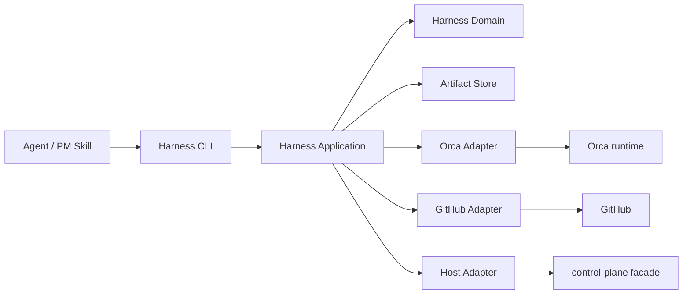

# Architecture Spine — Harness Engine

## 1. 架构结论

新增独立 `packages/harness-engine`，作为纯 TypeScript/Bun 可导入库和窄 CLI 核心。它吸收 mstar-harness 的确定性门禁设计，但不复制 mstar 的运行时状态源、宿主生态或路径约定。

`packages/control-plane` 保持现有职责，继续负责稳定配置、CapabilityReference、OMP/Claude Code 装配和安全启动。Harness Engine 只负责工程交付生命周期。两个包之间通过稳定 DTO 和 facade 连接，不允许互相导入内部领域模块。



依赖方向固定为：

```text
cli → application → domain
                 ↘ ports
adapters → ports
control-plane facade → control-plane public DTO only
```

领域内核不得导入 Bun、SQLite、GitHub、Orca、文件系统、进程环境或 control-plane 内部实现。

## 2. 权威所有权

| 对象 | 唯一事实后端 | Harness Engine 的角色 |
| --- | --- | --- |
| Workflow/Plan/Gate/Lease/Residual | 本地 ArtifactStore | 保存、校验、条件写入 |
| Run/Task/Dispatch/Worker/Delivery | Orca | 读取、关联、解释；不复制实时队列 |
| Issue/PR/checks/review/merge | GitHub | 读取、绑定 head、执行有界回读 |
| StableConfigRevision/AssemblyManifest | control-plane SQLite/API | 通过 facade 读取；不重新建模 |
| prompt/transcript/credentials/tool payload | Agent host | 永不进入 engine artifact |

不允许同一个对象在两个后端都成为可写权威。缓存或投影必须带来源、时间、版本和 Unknown 语义。

## 3. 模块结构

```text
packages/harness-engine/
  src/
    core/             # Result、Evidence、Unknown、Version、errors
    domain/           # Workflow、Plan、Assignment、Lease、Review、Residual
    gates/            # dispatch、worktree、sdd、iteration、pr-review
    application/      # commands、queries、orchestration use cases
    ports/            # ArtifactStore、CoordinationAdapter、DeliveryAdapter、HostAdapter
    adapters/
      json/           # 版本化本地 artifact 实现，首轮默认
      sqlite/         # 可选后续实现，不进入领域
      orca/           # 只读观察与 delivery 回执适配
      github/         # Issue/PR/check/review 适配
      hosts/
        omp/
        claude/
        codex/
        opencode/
    cli/              # 薄组合根
  tests/
    domain/
    contracts/
    adapters/
    integration/
    smoke/
```

首轮本地 ArtifactStore 默认使用版本化 JSON 文件，原因是它易审查、易回滚、与 Orca/GitHub 的引用模型相容。只有出现多 writer、并发查询或恢复压力的真实证据后，才新增 SQLite adapter；不因为 control-plane 使用 SQLite 就强制共享数据库。

## 4. 领域模型

### 4.1 标识与版本

- `workflowId` 标识一次迭代或独立工作流；
- `planId` 标识一个可独立验收和合入的计划；
- `taskId` 标识一个实现或审查任务；
- `dispatchId`、`workerId`、`deliveryId` 由 Orca 提供并按来源命名空间保存；
- `issueUrl`、`prUrl`、`headSha`、`baseSha` 由 GitHub/本地 Git 证据提供；
- 每个本地 artifact 有 `schemaVersion`、`revision` 和 `updatedAt`；
- 不使用文件 mtime 推导业务状态。

### 4.2 状态

Plan 生命周期：

```text
Todo → InProgress → InReview → Done
  ↘ Blocked ↗
```

Gate 结果采用封闭集合：

```text
pass | fail | blocked | unknown
```

`Done` 必须同时满足：

- 所有必需任务已回收；
- review package 存在且绑定 BASE..HEAD；
- QC/QA 通过；
- residual 已关闭或有显式 accept/risk-accepted；
- execution lease 已释放；
- 交付证据可回读。

### 4.3 Evidence 与 Unknown

所有外部结论使用：

```text
Known(value, evidenceRef, observedAt)
Unknown(reasonCode, observedAt, recovery)
```

禁止用 `false`、空数组、缺字段或进程退出码表示未知或成功。

## 5. Gate 设计

### 5.1 Dispatch gate

输入：Assignment、Plan、branch policy、host capability、lease 状态。

输出：可派发或阻断，以及稳定 violation code。

必须检查：

- `Execute as`、`Delegation`、`Task category`；
- 唯一 branch form；
- plan/feature worktree/owned paths；
- default branch protection；
- leaf anti-recursion；
- execution mode 与 QC seat 计划；
- 依赖和前置 gate。

### 5.2 Worktree/lease gate

- execution lease 按 `workflowId + planId + worktreePath` 唯一；
- integration merge lease 按 `workflowId + integrationBranch` 唯一；
- lease 写入必须携带 expected revision；
- Done 或 Blocked 释放/保留 lease 的行为必须显式；
- 不依赖进程内 mutex 解决跨进程写入；
- 无法证明 stale lease 已失效时返回 Blocked，不强抢。

### 5.3 SDD/QC gate

- 每个 task 记录实现前 BASE SHA；
- review package 使用明确 `base..head`，禁止用 `HEAD~1` 猜 diff；
- `sdd` 默认三席 QC；`inline` 允许单席；
- reviewer identity、planId、review range、diff basis 必须一致；
- task reviewer 不能替代 plan-level QC；
- QC 发现可修问题时默认 zero-residual，真正阻塞项才进入 residual register。

### 5.4 Iteration gate

首轮只机械验证：

```text
Phase 2 Execute
  → all plans Done
Phase 3 Close
  → compass completed + close evidence
Phase 4 PR Delivery
  → current head + checks + review + target branch
```

CI 或 AI review 仍在当前 head 上运行时，push gate 失败。Phase 1 的产品/架构判断继续由 BMad/Agent 负责。

### 5.5 PR review gate

第一轮只保存和重算：

- target PR 的 base/head；
- required checks；
- review state；
- findings 与 merge class；
- tally、score、verdict；
- merge-ready 结论及其证据。

旧 head 的结论在 head 变化后失效。首轮不重新发明 GitHub review 权限模型。

## 6. Adapter 合同

### 6.1 CoordinationAdapter

```text
getRun(runId)
getTask(taskId)
getDispatch(dispatchId)
getWorker(workerId)
getDelivery(deliveryId)
```

适配器只返回 allowlist DTO；原始 prompt、transcript、工具参数、凭据和未脱敏 stderr 不得越过边界。

### 6.2 DeliveryAdapter

```text
getIssue(issueRef)
getPullRequest(prRef)
getChecks(prRef, headSha)
getReviews(prRef, headSha)
prepareMergeReady(prRef, expectedHeadSha)
readAfterMerge(prRef, expectedHeadSha)
```

任何写入必须绑定当前 head，并在写前、写后回读。网络、权限、head 漂移或响应形状未知时返回 Unknown/Blocked，不重试扩大写入范围。

### 6.3 HostAdapter

```text
probe(hostContext)
prepare(assignment)
observe(operation)
interpret(observation)
```

HostAdapter 不拥有 Workflow/Plan 状态，只提供宿主能力和运行证据。OMP/Claude 的具体装配仍通过 control-plane facade；Codex/OpenCode 首轮只有 contract、fixture 和 capability 状态。

## 7. 数据流

### 7.1 派发

```text
load plan
  → validate assignment
  → validate branch/worktree
  → claim execution lease
  → host probe
  → Orca dispatch/readback
  → append dispatch evidence
```

派发成功不能直接等同于执行成功。accepted-but-not-executed、worker disconnected、delivery missing 均保持独立事实。

### 7.2 完成与审查

```text
worker_done
  → verify identity
  → read branch/head
  → create BASE..HEAD review package
  → task review
  → plan QC
  → QA gate
  → residual cleanup
  → release execution lease
```

`worker_done` 只允许推动到 InReview，不直接推动 Done。

### 7.3 PR 交付

```text
current head read
  → checks/reviews read
  → review arithmetic
  → merge-ready gate
  → explicit delivery action
  → post-action readback
```

## 8. 与 control-plane 的连接

Harness Engine 只依赖 control-plane 的公开 facade：

```text
getConfigRevision(revisionId)
getAssemblyManifest(revisionId, clientId)
probeClient(clientId)
prepareLaunchFacade(revisionId, clientId)
```

不得导入 `control-plane/src/domain` 或其 SQLite repository。control-plane 现有 OMP/Claude 启动路径、内容物化、隐私 allowlist 和 invocation cleanup 不因 engine 接入而改变。

## 9. 失败策略

| 情形 | 结果 |
| --- | --- |
| Orca 不可读 | Unknown；不重派、不伪造完成 |
| GitHub head 已变化 | 旧证据失效；重新读取并重新生成 review package |
| lease 不可证明已失效 | Blocked；不强抢 |
| host 未实现 | unsupported/unknown；不返回空成功 |
| Artifact schema 不兼容 | fail closed；仅允许只读导出 |
| 部分 delivery 缺失 | InReview/Blocked；不能 Done |
| 非关键可选证据缺失 | degraded，并列出缺失项 |

## 10. 验证策略

### 10.1 纯领域合同测试

覆盖状态转换、Assignment grammar、lease 竞争、QC seat mapping、head invalidation、Unknown 语义和 residual lifecycle。

### 10.2 Adapter contract tests

每个 adapter 使用相同的 golden DTO 和负例：权限失败、响应字段缺失、版本漂移、跨 Run、跨 host、head 漂移、重复 delivery。

### 10.3 真实 smoke

- Orca：只读 ID 关联、真实 delivery 读取和失联/未知分支；
- GitHub：当前 head、checks、review state、写后回读；
- OMP/Claude：只证明既有 control-plane 行为不回归；
- Codex/OpenCode：在真实入口激活前只允许 contract/fixture 验证。

### 10.4 状态与证据优先级

外部验收以可回读证据为准，优先级（从高到低）固定为：代码实际路径、目标测试与全量测试 → failure ledger → worktree/file ownership → independent review → controlled integration → real smoke/not available。BMad `SPEC`、Architecture、Epic 和 `sprint-status` 只能定义范围与预期，不能证明实现或覆盖任何 gate。

BMad Epic/Story 的 `Done` 只是 bookkeeping；领域 Plan `Done` 是本地生命周期状态。二者都不自动等于 external acceptance 或 `Verified`，不得覆盖 gate；Plan `Done` 仍必须满足 §4.2。5.1 的本地 `CompletionEvidence` 只支持本地状态转换；5.2 的结构化 completion gate 负责 plan-level completion 证据，二者均不替代外部验收。external acceptance、`Verified`、`active` 必须由六个外部硬门全部 `pass` 才能成立。任何硬门未通过时，最终状态只能是 `Partial`、`Draft`、`Blocked` 或 `Unknown`。所有 P0 必须有代码/测试、failure ledger、worktree/file ownership、independent review、controlled integration 和 real smoke 证据；controlled fixture/injected 结果只能证明 controlled integration，不得冒充 real smoke；真实 Orca/GitHub smoke 必须真实通过，`not available` 仅表示门状态而不是 `pass`，不得形成 external acceptance 或 `active`。

硬门缺失或冲突时 fail closed，并记录缺失/冲突项、恢复动作、唯一 owner 和证据引用；failure ledger 任一当前失败未归因、未重跑或缺少 closure evidence，或只引用旧快照时，同样不得过门。证据补齐并可回读前保持 `Partial`、`Draft`、`Blocked` 或 `Unknown`。`ValidationDecision` 由外部验收记录产生，不能由 BMad status 生成。

## 11. 迁移顺序

1. 先建立 `harness-engine` domain/ports，不改变现有工具；
2. 把 `dispatch_*`、`worktree-gc`、`worker_snapshot` 的行为冻结为 golden fixtures；
3. 接入 JSON ArtifactStore 和本地 gate CLI；
4. 接入 Orca readback；
5. 接入 GitHub current-head/review/checks；
6. 接入 OMP/Claude facade；
7. 仅在真实证据足够时激活 Codex/OpenCode；
8. 旧工具继续保留为兼容查询，直到新入口通过同等 smoke 和独立 review；
9. 不先删除旧路径，再设计替代。

## 11.5 mstar 资产吸收层次

完整映射见 `spec-harness-engine/mstar-adoption-map.md`。吸收不只限于核心 gate：

1. `core/path/status/workflow/lease/dispatch/worktree/sdd` 进入第一批 engine domain/gates；
2. `project/prreview/iteration/host/roles/qc` 进入第二批 engine contract 与 adapter；
3. `lint/audit/skill-authoring/plugin validate/migrate` 进入质量和维护工具；
4. `compound/design-md/release/UI observation` 只在真实使用产生价值后进入；
5. mstar 的 Skill 文本、宿主具体路径和 `.mstar` 状态树不直接成为本仓 SSOT。

吸收顺序按“先事实和安全门，再后端和宿主，再质量维护”推进，不按上游目录顺序机械搬运。

## 12. 反向约束

- 不共享 control-plane SQLite；
- 不让引擎解析动态任务正文；
- 不用 prompt 承诺代替 host capability evidence；
- 不把 Orca TUI 当作协调状态后端；
- 不用 GitHub Project 状态替代 Issue/PR 当前事实；
- 不把“有文件/有进程/退出码为零”提升为 Verified；
- 不把 adapter 数量或 skill 数量当作成功指标。
