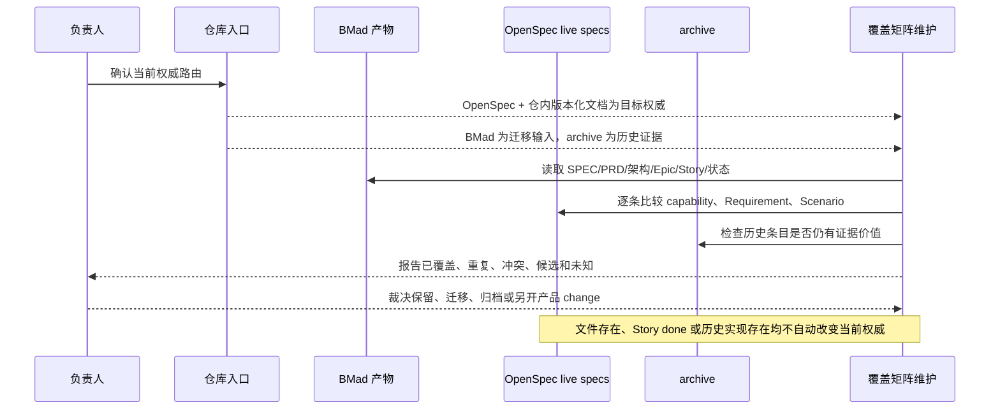

# 业务现状

## 调查口径

- 业务基线日期：2026-08-30
- 业务范围：仓库内产品需求、架构决定、实现状态和长期规范之间的资料归属与迁移关系；不改变任何产品行为。
- 材料口径（来源、版本、完整性）：完整读取当前入口、OpenSpec 配置、三份 live spec、BMad SPEC/epics/sprint-status 及主要迁移提案；其余 BMad 文件先按路径清单纳入待逐条覆盖范围。

## 角色与责任

| 角色/系统 | 当前责任 | 输入 | 输出 |
|---|---|---|---|
| 负责人 | 对产品方向、范围、权威变更和高风险迁移作最终裁决 | 当前讨论、公开合同、证据 | 明确批准、拒绝、保留或重开决定 |
| `entrypoints/agent-system.md` | 声明当前仓库任务路由和目标权威结构 | 仓库治理决定 | OpenSpec/live docs/BMad/archive 的职责边界 |
| `openspec/specs/` | 保存三份当前生效 capability 规范 | 已确认需求和规范变更 | 可被 strict validator 验证的长期 Requirement/Scenario |
| `_bmad-output/` | 保存迁移前的 PRD、架构、Epic、Story、回顾和状态输入 | BMad workflow 产物 | 临时现状来源和历史证据；不自动产生当前授权 |
| `_archive/` | 保存被降级的旧规范、旧实现和旧过程资产 | 历史迁移结果 | 可追溯证据，不作为当前业务入口 |
| 维护 Session | 读取、比较、标注资料并形成覆盖矩阵 | 上述各层文件 | 可审查的保留/迁移/归档/未知分类 |

## 当前业务流程

## 业务对象与状态

| 对象 | 关键字段/身份 | 状态 | 状态变化条件 |
|---|---|---|---|
| BMad capability | `CAP-1`～`CAP-8` | 完整目标态描述、MVP 收窄说明或待重新裁决 | BMad SPEC/epics 发生明确同步或负责人重新裁决 |
| BMad Epic/Story | `epic-*`、Story 编号、`sprint-status.yaml` 状态 | `backlog`、`in-progress`、`done`、retro/action item 状态 | BMad workflow 或人工回写；不等于 OpenSpec 生效 |
| Architecture Decision | `AD-1`～`AD-22` | adopted、deferred、被后续澄清替代或历史 | 架构产出和后续裁决形成可追溯替代链 |
| OpenSpec capability | 目录名、Requirement、Scenario | live、archive 或 change 中待审 | OpenSpec change 完成同步/归档，或按迁移规则降级 |
| 覆盖关系 | BMad ID ↔ OpenSpec capability/Requirement/仓内文档 | covered、partial、conflict、candidate、unknown | 逐条读取正文并记录证据后才能改变 |

## 异常与失败分支

| 场景 | 当前行为 | 业务影响 |
|---|---|---|
| BMad 与入口权威表述冲突 | 两份文本并存；当前入口要求以 2026-08-30 方向为准 | 直接引用 BMad 可能错误扩大产品范围 |
| BMad Story 标记 done 但 live spec 无对应条目 | 状态文件显示完成，OpenSpec 长期合同未覆盖 | 只能说明历史交付状态，不能宣称当前规范闭环 |
| live spec 与 BMad 同主题但语义不同 | 当前没有自动覆盖矩阵作强制校验 | 可能重复维护或静默丢失边界 |
| 历史 archive 条目与当前 live spec 同名/相近 | archive 保留证据，OpenSpec CLI 只看 live 根 | 必须人工确认是否是替代关系，不能按文件名归档/恢复 |
| 只读取 Purpose 或文件名 | 无法确认 Requirement 正文是否绑定旧 `.cap` 实现 | 可能误归档仍适用的通用规范，或保留重复权威 |
| 覆盖证据不足 | 当前没有合法覆盖结论 | 对应条目标为 `unknown`，不自动迁移或删除 |

## 当前边界与已知问题

- 当前业务事实是“多层资料并存、入口已宣布权威迁移方向、逐条覆盖尚未完成”；本 change 不把迁移目标写成已经完成。
- 本 change 的 `skip_specs: true` 表示覆盖矩阵是资料治理工件，不新增产品 capability；长期规范只在后续有真实需求 delta 时变化。
- 重点冲突已经确认在 BMad SPEC 的完整目标态 CAP 与 epics 对 MVP 的收窄、以及 README 历史段落与入口新裁决之间；其余冲突需要逐文件矩阵继续核验。
- 目标迁移方案和是否归档具体材料进入 `05-改造方案/改造方案.md`，不在本文件提前执行。
