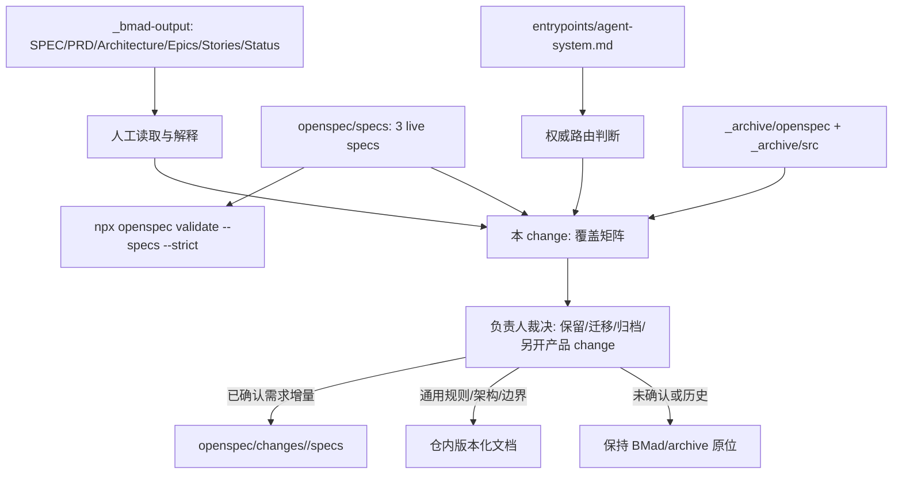

# 技术现状

## 调查基线

- 主干基线 commit：`ccd54d7046b7fda4f08db48ab70556bef23ad206`
- 需求分支 commit：当前工作分支 `Eridanus117/clearify`；覆盖 change 与现状基线 change 均为未提交工作。
- 运行态核验时间点：2026-08-30；OpenSpec root/schema/strict validation 已实际运行，覆盖矩阵工具尚未存在。

| 仓库 | 模块 | 证据类型（源码/历史测试/运行态/推断） | 核验方式 |
|---|---|---|---|
| 当前仓 | `openspec/config.yaml` | 源码/配置 | 读取 `schema: delivery-change`、权威落位、BMad 迁移和批准/验证规则 |
| 当前仓 | `openspec/specs/*/spec.md` | 当前规范/运行态 | 列出并完整读取三份 live spec；strict validation 通过 |
| 当前仓 | `openspec/changes/` | 当前流程资产 | `openspec list` 显示活动 change；历史 change 在 `archive/` |
| 当前仓 | `.delivery-spec-runtime/` | 流程运行时 | 读取 schema、contracts、commands；runtime-check/doctor/schemas 已通过 |
| 当前仓 | `_bmad-output/specs/` | 迁移输入 | 读取 `SPEC.md`、`glossary.md`、`validation-contract.md` |
| 当前仓 | `_bmad-output/planning-artifacts/` | 迁移输入/历史证据 | 列出 PRD、brief、architecture、research、UX、proposal、epics 和 reviews |
| 当前仓 | `_bmad-output/implementation-artifacts/` | 迁移输入/历史证据 | 列出 Story spec、retro、context、validation report、deferred work、sprint status |
| 当前仓 | `_archive/openspec/`、`_archive/src/` | 历史资产 | 列出归档规范和旧实现；不参与当前 OpenSpec live validation |
| 当前仓 | 覆盖关系 | 推断/缺口 | 本次检索未发现自动生成 BMad→OpenSpec 逐条覆盖矩阵的现有工具或机器合同 |

## 当前技术流程

## 接口与数据边界

| 边界 | 当前接口/模型 | 调用方 | 副作用 | 失败语义 |
|---|---|---|---|---|
| BMad 需求 → 规范 | `CAP-1`～`CAP-8`、MVP-FR、NFR、AR | 人工维护/审阅 | 产生 Markdown 产物；无自动同步 | ID 相同不代表语义相同；冲突必须人工记录 |
| BMad 架构 → 实现 | `AD-1`～`AD-22`、Architecture Spine | BMad story/spec | 约束实现和验收叙述 | adopted/deferred/后续澄清可能在不同文件中分散，当前无统一机器投影 |
| BMad Story → 状态 | Story 文件 + `sprint-status.yaml` | BMad workflow | 更新 YAML 状态 | `done` 只证明 BMad 状态，不证明 live OpenSpec 覆盖或当前运行态 |
| live spec → OpenSpec validator | `openspec/specs/<capability>/spec.md` 的 Requirement/Scenario | `npx openspec validate --specs --strict` | 只读校验 | 只覆盖 live specs，不检查 BMad 覆盖完整性 |
| OpenSpec change → 长期规范 | `openspec/changes/<slug>/` + archive lifecycle | `/opsx-*`/CLI | approved change 可同步/归档 | `skip_specs` 适用于纯资料 change；不得虚构产品 delta |
| 归档资产 → 当前判断 | `_archive/` 路径和历史文档 | 人工调查 | 只读取证 | 历史内容不产生当前授权，不能因文件名相似自动恢复 |
| 覆盖矩阵 → 后续行动 | 本 change 计划新增的 Markdown/机器记录 | 负责人/后续 Session | 记录关系和未知 | 未逐条读正文时保持 `unknown`，不自动迁移或删除 |

## 事务、缓存、通知和兼容

- 事务：BMad 文件、OpenSpec 文件和 YAML 状态分别由各自 workflow 写入；未发现跨两套资料的原子同步事务。
- 缓存：`sprint-status.yaml` 是 BMad 文件系统状态快照；OpenSpec 的 live specs 和 changes 是另一套目录事实。没有发现覆盖矩阵缓存或统一索引数据库。
- 通知：负责人裁决通过当前会话/公开合同产生；没有发现 BMad 状态自动通知 OpenSpec 或反向同步机制。
- 兼容：保留 BMad 原始路径、Story/CAP/AD ID 和 archive 历史路径；新矩阵使用相对路径引用，不重命名历史 ID，不把同名能力强行合并。

## 部署与运行态

| 事实 | 环境/机器 | 证据 | 核验时间 |
|---|---|---|---|
| live OpenSpec 当前为三份 | 当前仓库 | `npx openspec list --specs` | 2026-08-30 |
| custom `delivery-change` 可用 | 当前仓库 | `npx openspec schemas`、runtime-check | 2026-08-30 |
| BMad 状态最后记录为 2026-08-27 14:06 | 当前仓库 | `_bmad-output/implementation-artifacts/sprint-status.yaml` 第 31-32 行 | 2026-08-30 |
| 覆盖 change 已建立 | 当前仓库 | `openspec/changes/bmad-openspec-coverage/.openspec.yaml` | 2026-08-30 |
| 实际产品运行态 | 未核验 | 本 change 只调查资料关系，不启动客户端、不修改 SQLite | 2026-08-30 |

## 已知缺口与不确定性

- `[事实]` BMad 的身份体系是 CAP/FR/NFR/AR/AD/Epic/Story，live OpenSpec 的身份体系是 capability/Requirement/Scenario；当前没有已验证的一对一机器映射。
- `[事实]` BMad `sprint-status.yaml` 的 Epic 1～4 和多数 Story 标为 `done`，但该状态不自动改变 `openspec/specs/` 或仓内版本化文档。
- `[事实]` BMad 已明确记录过 CAP 与 MVP/epics 的范围收窄及后续 Epic 3/4 重开；这些决定需要逐条映射到当前权威位置，不能只看 SPEC 的 CAP 正文。
- `[事实]` 当前 OpenSpec strict validator 只验证三份 live spec；它不会报告 BMad 覆盖缺口。
- `[推断]` 下一步最有价值的资产是“主题/来源/当前权威落位/覆盖状态/冲突/行动”矩阵，而不是继续新增一份总 SPEC。
- `[推断]` 覆盖矩阵完成后，仍需要负责人逐项批准哪些历史决定进入长期规范；矩阵本身不应自动执行迁移、归档或产品改造。
- 目标落位、迁移顺序、具体保留/归档清单进入 `05-改造方案/改造方案.md`。
