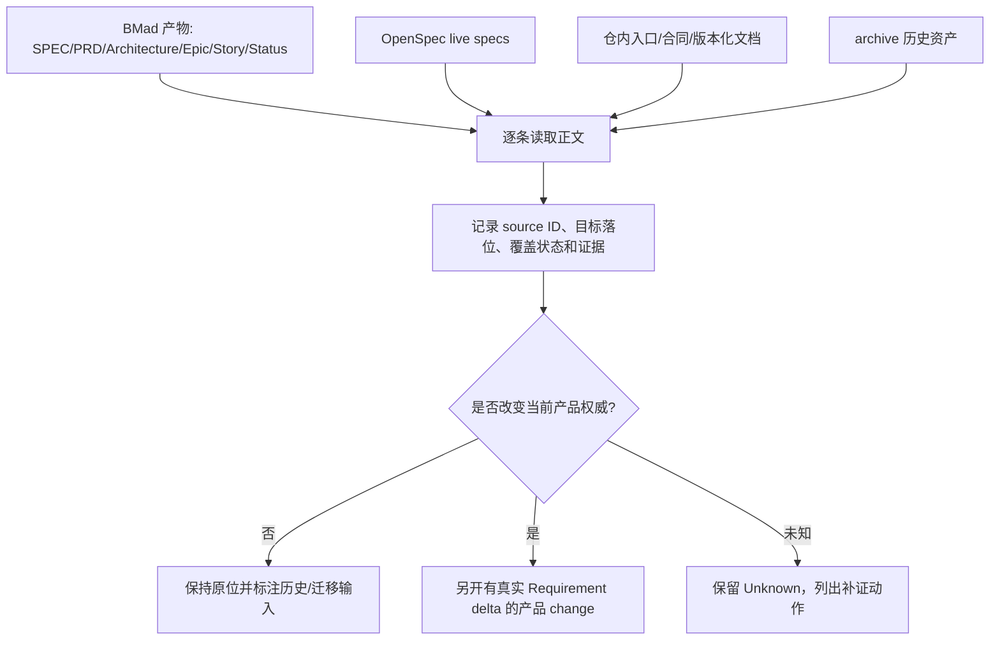

# 改造计划

## 目标与非目标

### 目标

- 建立 `_bmad-output/` 主要产物到 `openspec/specs/`、仓内版本化文档或历史归档的逐条覆盖矩阵。
- 对每条关系记录来源路径、稳定 ID、当前落位、覆盖状态、冲突、缺口和下一步行动。
- 让迁移判断遵循“先读正文，再决定归属”：不因文件名、Purpose、Story `done` 或代码存在自动迁移。
- 把真正需要产品裁决的内容单独标为候选，后续另开有 Requirement delta 的 OpenSpec change。

### 非目标

- 不在本 change 修改 `openspec/specs/`、`_bmad-output/`、`_archive/` 或产品源码。
- 不自动把 BMad 内容转换成 OpenSpec Requirement，不自动合并相似 capability。
- 不删除、重命名、归档或同步任何历史材料。
- 不把 BMad 的 `done` 状态解释为当前产品验收，不把架构目标态解释为当前运行能力。
- 不修复 control-plane CLI 依赖阻断；该问题另行分流。

## 目标业务与技术流程

## 初始覆盖矩阵

| 主题 | BMad 来源 | 当前 OpenSpec/文档落位 | 状态 | 当前判断 | 后续动作 |
|---|---|---|---|---|---|
| Agent 行为证据与状态分层 | `SPEC.md` CAP-3/5/6/8；`validation-contract.md` | `openspec/specs/agent-behavior-evaluation/spec.md`；仓内验收合同 | partial | 行为评测原则和证据层已有 live spec；MVP 专属 manifest/operation/样本门仍主要在 BMad | 逐条核对 Requirement/Scenario，确认哪些是通用规范、哪些是当前产品外部验收门 |
| Skill 发现、路由和渐进披露 | PRD/Architecture/Story 中的 Skill 合同 | `openspec/specs/agent-skill-design/spec.md`；`plugins/`、`vendor/bmad/skills/` | partial | 通用 Skill 设计原则有 live spec；profile 授权和具体资产装配仍分散在仓内入口/实现 | 对照现有资产和 runtime 装配路径，避免把资产清单当作产品需求 |
| 外部事实优先调研 | BMad research、CAP-1、研究型 story | `openspec/specs/research-first-assembly/spec.md` | covered（原则层） | 调研优先、一手来源、证据边界已形成通用 live spec | 仅补充缺失的产品适用边界，不迁移具体历史研究结论 |
| Control-plane 产品能力 | `_bmad-output/specs/spec-agent-system/SPEC.md` CAP-2/3/4/8；`epics.md` Epic 1～4；implementation specs | 当前三份 live spec 无完整 control-plane capability；源码在 `packages/control-plane/` | conflict/partial | BMad 同时包含完整目标态 CAP、MVP 收窄、Epic 3/4 重开和实现记录；不能直接合并成一个当前 Requirement | 按 CAP/Epic/Story/AD 建立逐条关系，确认长期需求应进入哪个 capability 或仓内合同 |
| 架构决策与失败边界 | `ARCHITECTURE-SPINE.md` AD-1～AD-22 及 reviews | `entrypoints/agent-system.md`、源码、OpenSpec change 证据 | partial | 架构骨架已被 BMad adopted，但目标权威要求迁入仓内版本化文档；当前没有完整 AD 覆盖清单 | 对每个 AD 标注 adopted/deferred/superseded/current evidence，禁止只迁移摘要 |
| 实现状态与验收 | `sprint-status.yaml`、Story specs、validation report、retros | OpenSpec `change` 生命周期与当前验收合同 | conflict | BMad 文件系统状态与 OpenSpec task/acceptance 不是同一状态机 | 记录状态映射规则；不将 `done` 自动转为 OpenSpec `verified` |
| 已退役 `.cap` 能力 | Epic 4/Story 4.7、旧 OpenSpec specs | `_archive/openspec/`、`_archive/src/`；当前 control-plane adapter | covered（退役事实） | 历史实现已归档，仍需区分可复用原则和 `.cap` 私有机制 | 只保留证据引用；不恢复旧 CAP 作为当前实现基线 |

## 影响面

| 仓库/系统 | 模块/接口 | 变更 | 兼容约束 | 责任方 |
|---|---|---|---|---|
| 当前仓 | `openspec/changes/bmad-openspec-coverage/` | 新增覆盖调查与迁移边界工件 | 不改 live specs 或 BMad 原文 | 当前维护 Session |
| 当前仓 | `openspec/specs/` | 只读对照 | 3 份 live spec 保持不变 | 当前维护 Session |
| 当前仓 | `_bmad-output/` | 只读逐条调查 | 保留原始路径、ID 和状态 | 后续迁移负责人 |
| 当前仓 | `_archive/` | 只读证据核对 | 不恢复历史资产 | 后续迁移负责人 |
| 当前仓 | `packages/control-plane/` | 只读核对实现边界 | 不修复运行依赖 | 控制面维护者 |

## 实施切片与依赖

| 顺序 | 切片 | 前置 | 独立验收 | 回滚边界 |
|---:|---|---|---|---|
| 1 | 来源与主题清单 | 现状基线已批准 | 原始来源合同通过 | 删除本 change 来源工件 |
| 2 | 需求/架构/实现状态映射 | 来源清单 | 每个主题有来源、目标落位和状态 | 删除覆盖矩阵，不触碰源文件 |
| 3 | 冲突与迁移候选审查 | 映射已完成 | 冲突、未知和候选均有证据路径 | 回退本 change 计划 |
| 4 | 后续入口分流 | 候选审查完成 | 产品变更与资料迁移分别有入口 | 不执行迁移；保留审查记录 |

## 数据与兼容迁移

- 数据：只新增 Markdown 与 `change-sources.json`；矩阵记录路径和 ID，不复制 BMad 私人上下文、凭据、prompt、transcript 或运行态。
- 接口：不改 CLI、OpenSpec live spec、BMad workflow、sprint status 或源码接口。
- 灰度：不适用；覆盖矩阵只在本 change 内生效。
- 回滚：移除本 change 即可；不删除 BMad/archive，不回滚既有 runtime 子模块初始化。

## 风险与处置

| 风险 | 影响 | 预防/缓解 | 停止条件 |
|---|---|---|---|
| 只按文件名判断覆盖 | 丢失 Requirement 或错误归档 | 要求逐条读取正文并保留证据路径 | 无法回读正文时标记 unknown，不继续归类 |
| 将 BMad done 当作当前 verified | 虚假完成 | 明确两套状态机分离 | 发现无运行证据仍声称完成时停止 |
| 把完整目标态 CAP 与 MVP 收窄混为一谈 | 产品范围膨胀 | 分开记录 CAP intent、MVP 归属和 Epic 激活状态 | 不能区分目标态/当前态时停止迁移 |
| 覆盖矩阵反向变成第三套权威 | 权威进一步分裂 | 矩阵只做证据和分流，不保存新的产品规则 | 矩阵出现无来源的 Requirement 时停止 |
| 迁移触碰公开仓敏感内容 | 泄露个人或运行态信息 | 只保存路径、摘要、状态和 hash/版本 | 发现敏感原文进入工件时停止 |

## 决策日志

| ID | 决策 | 依据 | 替代方案 | 影响 | 日期 |
|---|---|---|---|---|---|
| D-001 | 覆盖矩阵作为独立资料治理 change，声明 `skip_specs: true` | 目标是确认现状和归属，不新增产品能力 | 直接把 BMad 转写成 live spec | 避免虚构需求；后续产品 change 保持可分流 | 2026-08-30 |
| D-002 | BMad 只作为迁移输入和历史证据 | `entrypoints/agent-system.md` 2026-08-30 权威变更 | 继续把 BMad 作为长期唯一真源 | 需要逐条覆盖，但不丢失既有决定 | 2026-08-30 |
| D-003 | 不自动把同名 CAP/Requirement 合并 | CAP、MVP-FR、AD、Epic/Story 与 live spec Requirement 粒度不同 | 按名称或关键词批量合并 | 保留语义差异，增加人工审阅成本 | 2026-08-30 |
| D-004 | `done`、`adopted`、源码存在和 strict pass 分别记录 | 它们证明的事实层不同 | 统一成“已完成” | 覆盖矩阵必须保留证据层和 Unknown | 2026-08-30 |

## 待决问题

- 是否需要为每个 CAP/AD/Epic/Story 建立稳定的机器 ID 映射，还是先维持人工可读矩阵；这不阻塞第一轮手工覆盖。
- BMad 中哪些架构决策应成为仓内长期版本化合同，需逐条审阅后由负责人裁决。
- 是否另开 CLI 依赖修复 change，取决于确认 `react/jsx-dev-runtime` 缺失的实际安装/打包根因；本 change 不代为修复。
